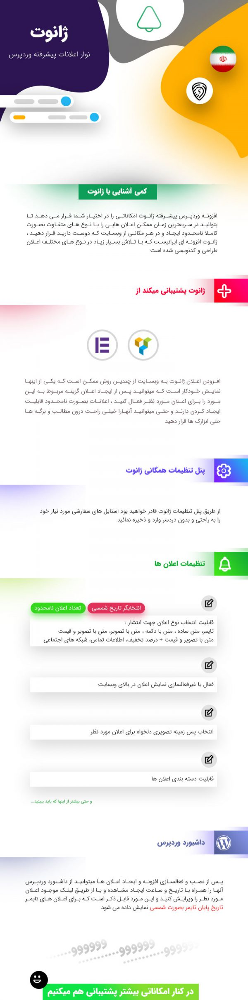

# افزونه وردپرس نوار اعلانات پیشرفته ژانوت (Zhanot)

## معرفی
افزونه وردپرس نوار اعلانات پیشرفته ژانوت (Zhanot) یک افزونه قدرتمند برای ایجاد و مدیریت اعلان‌های مختلف در وبسایت‌های وردپرسی است. این افزونه به شما امکان می‌دهد تا اعلان‌های واکنشگرا و سفارشی را به راحتی ایجاد و مدیریت کنید.

## ویژگی‌ها
- **نمایش تاریخ پایان برای اعلان‌های تایمر در داشبورد وردپرس**
- **قابلیت بروزرسانی سریع از داشبورد وردپرس**
- **قابلیت بررسی آخرین نسخه موجود از بخش افزونه‌ها**
- **قابلیت ایجاد نامحدود اعلان**
- **نمایش کدکوتاه اعلان در صفحه همه اعلان‌ها**
- **نمایش نوع اعلان برای مدیریت بهتر در صفحه اعلان‌ها**
- **قابلیت دسته‌بندی اعلان‌ها**
- **اعلان‌های کاملا واکنشگرا**
- **پنل تنظیمات همگانی برای افزودن استایل‌های سفارشی**
- **راهنمای کامل افزونه در صفحه تنظیمات**
- **نمایش کد کوتاه و کد PHP اعلان ایجاد شده در صفحه افزودن اعلان**
- **نمایش اعلان مورد نظر بصورت خودکار در بالای وبسایت**
- **نمایش اعلان بصورت عریض**
- **انتخاب پس‌زمینه برای اعلان**
- **تغییر رنگ پس‌زمینه محتوای اعلان**
- **تغییر رنگ متن اعلان**
- **ایجاد دکمه در اعلان**
- **دارای انتخابگر تاریخ شمسی**

## نصب
1. فایل افزونه را دانلود کنید.
2. به داشبورد وردپرس خود بروید و به مسیر `افزونه‌ها > افزودن جدید` بروید.
3. فایل افزونه را بارگذاری و نصب کنید.
4. افزونه را فعال کنید.

## استفاده
پس از فعال‌سازی افزونه، می‌توانید از طریق داشبورد وردپرس به بخش اعلان‌ها دسترسی پیدا کنید و اعلان‌های جدید ایجاد کنید.

## تصاویر

## پشتیبانی
در صورت داشتن هرگونه سوال یا مشکل، می‌توانید با پشتیبان سایت در ارتباط باشید.

## مجوز
این افزونه تحت مجوز GPL-3.0 منتشر شده است.

## مشارکت
ما از مشارکت‌های شما استقبال می‌کنیم. برای مشارکت در توسعه این افزونه، می‌توانید یک Pull Request در مخزن گیت‌هاب ما ارسال کنید.

## لینک‌ها

- [مخزن گیت‌هاب](https://github.com/morpheusadam/zhanot.git)

